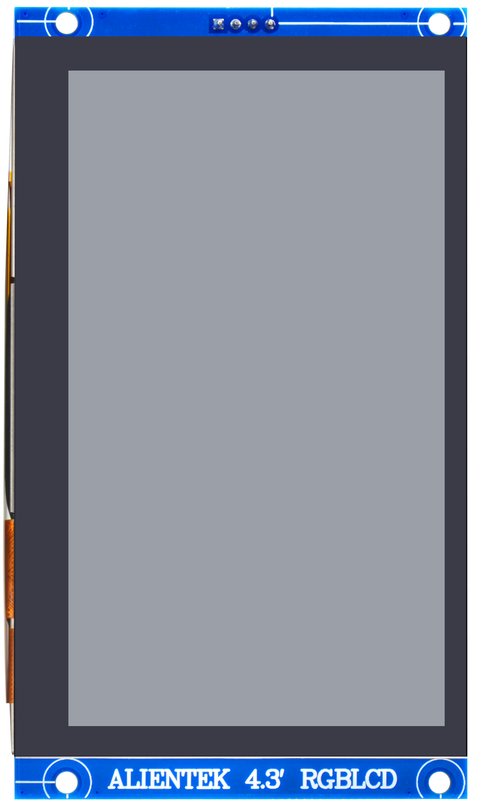
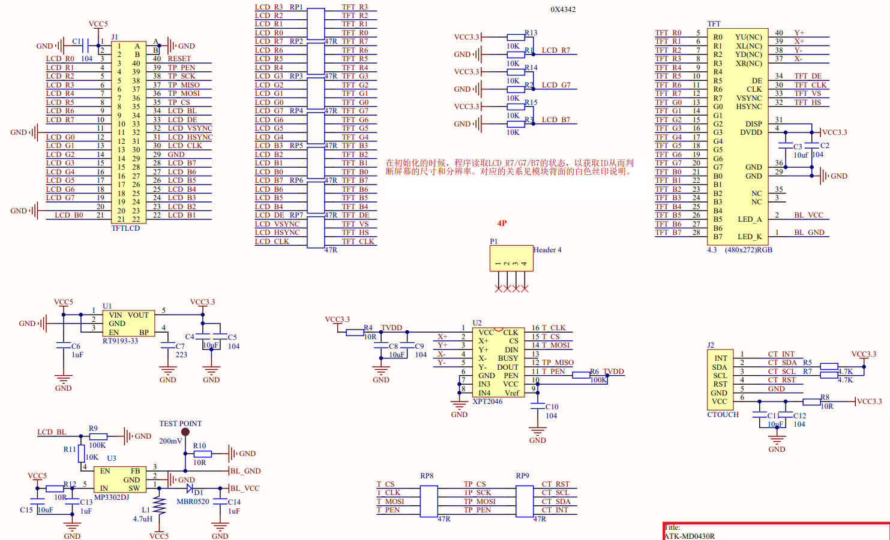

## 1 Introduction

### 1.1 Appearence

The ATK-MD0430 module looks like this:

### 1.2 Features

The ATK-MD0430R module is a high-performance 4.3 inch RGBLCD capacitive touch screen module launched by Zhengdian Atom. This module has two LCD resolutions, 480 * 272 and 800 * 480, corresponding to models ATK-MD0430R-480272 and ATK-MD0430R-800480, which support 24 bit true color display. At the same time, the ATK-MD0430R module also supports touch, using a capacitive touch screen that supports 5-point simultaneous touch, providing excellent control effects.

### 1.3 Parameter

Here are the product basic parameters:

| Parameter               | Describe                                                     |
| ----------------------- | ------------------------------------------------------------ |
| Communication Interface | LCD: Parallel 24 bit RGB interface Touch: IIC            |
| Color Format            | RGB888 (compatible with RGB565)                              |
| Color Depth             | 24-bit                                                       |
| LCD Resolution          | ATK-MD0430R-480272: 480x272 ATK-MD0430R-800480: 800x480 |
| Screen Size             | 4.3 inch                                                     |
| Touch screen type       | Capacitive touch                                             |
| Touch Point Count       | Up to 5 simultaneous touch points                            |
| Operating Temperature   | -20℃ ~ 70℃                                                   |
| Storage Temperature     | -30℃ ~ 80℃                                                   |
| Mudule Size             | 68mm*118mm                                                   |

The electrical parameters are shown in the following table:

| Parameter         | Describe                                                     |
| ----------------- | ------------------------------------------------------------ |
| Supply voltage    | 5V                                                           |
| IO port level     | 3.3V                                                         |
| Power dissipation | ATK-MD0430R-480272:40~165mA ATK-MD0430R-800480:120~320mA |

### 1.4 Interface

The ATK-MD0430R module is connected to the external circuit through a 40P FPC socket. The detailed description of each pin is shown in the table below.

| Number | Name  | Describe                                                    |
| ------ | ----- | ----------------------------------------------------------- |
| 1~2    | VCC5  | Power supply (5V)                                           |
| 3~10   | R0~R7 | 8bit digital Red data input(RO:LSB; R7:MSB)                 |
| 11     | GND   | Power ground                                                |
| 12~19  | G0~G7 | 8bit digital Green data input(GO:LSB; G7:MSB)               |
| 20     | GND   | Power ground                                                |
| 21~28  | B0~B7 | 8bit digital Blue data input(BO:LSB; B7:MSB)                |
| 29     | GND   | Power ground                                                |
| 30     | CLK   | Clock signal. Latching data at the rising edge              |
| 31     | HSYNC | Horizontal Sync input. Negative polarity                    |
| 32     | VSYNC | Vertical Sync input. Negative polarity                      |
| 33     | DE    | Data input Enable. Active high to enable the data input Bus |
| 34     | BL    | Backlight Anode                                             |
| 35     | CS    | CTP external reset signal, Low is active                    |
| 36     | MOSI  | CTP I2C data input and output                               |
| 37     | MISO  | NC                                                          |
| 38     | SCK   | CTP I2C clock input                                         |
| 39     | PEN   | CTP External interrupt to the host                          |
| 40     | RESET | LCD Reset                                                   |

## 2 Schematic

The schematic diagram of the ATK-MD0430R module is shown as follows.

